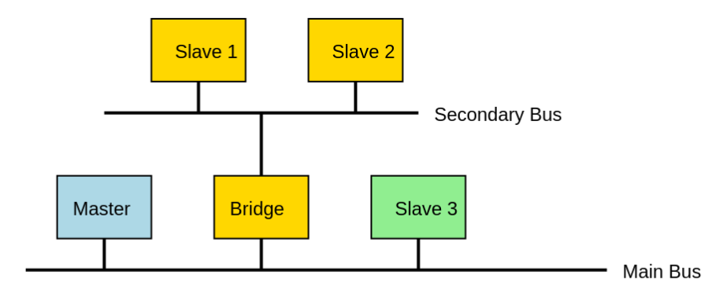
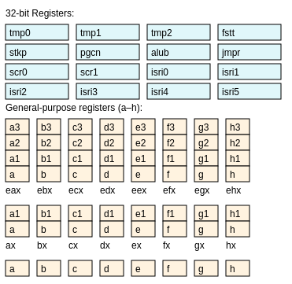
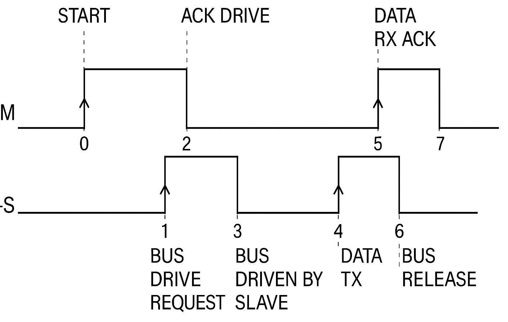
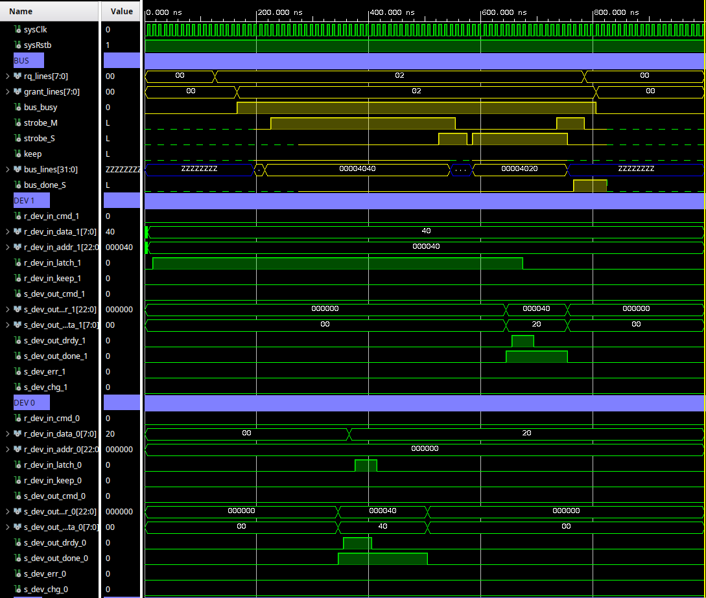

# oisc-soc
## Introduction
This project is about a fully programmable System-on-Chip on Artyx FPGAs which consists in several modules attached to an internal 32-bit wide system bus. The core is a custom OISC processor, implementing the `SUBLEQ` paradigm. The SoC contains several modules:
- OISC CPU
- I2C transceiver
- Two UART transceivers
- SRAM controller (controls an external 128kb SRAM expansion module)
- VGA output at 240x160, 60Hz video signal
- Two 8-bit GPIO ports

<p align="center"></p>

These modules are connected to a shared internal 32-bit bus with arbitration that is organized in the following way:
```
bit index:  31                30 downto 8                 7 downto 0
meaning:    C                 AAAAAAAAAAAAAAAAAAAAAAA     DDDDDDDD
            Command (1 bit)   Address (23 bits)           Data (8 bits)
```
The core idea behind the SoC is that everything is memory mapped, so there are bot <b>physical</b> and <b>virtual</b> addresses.
- Each module attached to the bus has a specific address space.
- The address space of a given module is further partitioned between its internal sub-modules (if any).
- Specific functions of each device/sub-device can be attached to specific addresses.
- The address might correspond to:
  * Physical registers / SRAM memory locations
  * Logical registers (grouping of smaller physical ones)
  * Virtual registers (attached to specific device functions)

The CPU can then reach any device or sub-device in the SoC totally <b>transparently</b> by simple read/write operations, sometimes performing complex tasks with a single instruction.

## Internal Bus
Each SoC module is connected to the internal bus via a common interface. This handles the low level signalling that allows the data to be moved around the system.
- At any given time, the bus can be idle or there can be only one device that is mastering it.
- Once the bus is assigned by the arbiter to a master, all the other devices' bus interfaces enter in slave mode.
- When in slave mode, each interface listens for data directed/requested to/from them by comparing the transmitted address with their own address space.
- A transaction may consist in a single byte transfer or in multiple transfers, holding the bus busy.

If a device has internal sub-devices, these are attached to a device-wide secondary bus that shares the same logic and interface of the main bus. The connection between the two is done by means of a bridge.
<p align="center"></p>
This connection is completely transparent to the other devices, including the CU, that can then address the internal sub-devices as if they were connected to the main bus.

## CPU architecture - Internal Modules
The CPU contains two main modules: the core and the interrupt handler.

### Core
The core contains the fetch-execute cycle, the ALU, the internal registers and an additional sub-module that is used to do bit-manipulation. This is too memory mapped and so bit-manipulation is triggered by simply reading and writing to appropriate virtual registers. Here is a schema of the device's registers.
<p align="center"></p>

So there are 32-bit specialized registers:
- tmp0, tmp1 and tmp2: general purpose registers.
- fstt: flags and status register
- stkp: stack pointer
- pgcn: program counter
- alub: B-operand in the ALU
- jmpr: jump register
- scr0, scr1: scratchpad registers
- isri0, isri1, isri2, isri3, isri4, isri5: interrupt service routines pointers
And then general purpose registers:
- a, a1, a2, a3, b, b1, b2, b3, ..., h, h1, h2, h3 : 8-bit registers
- ea, eb, ..., eh: 16-bit registers as logical groupings of two 8-bit registers. For instance: ea = a1 (higher), a (lower), etc
- eax, ebx, ..., ehx : 32-bit registers as logical groupings of four 8-bit registers. For instance: eax = a3, a2, a1, a, etc.

### Interrupt handler
This module receives the interrupt requests and makes the CPU execute the appropriate service routine.

### Instructions
The instruction is essentially an arithmetic operation (subtraction) followed by a branch depending on the sign and modulo of the result. It is called `SUBLEQ` (SUbtract and Branch if Less or EQual to zero). The instruction consists of three operands A, B, C:
- A and B are subtracted together: B = B - A
- C contains a memory address.
The following subtraction and branch is performed:
```
B = B - A
IF B <= 0 THEN program_counter = C
ELSE program_counter = program_counter + 1
```

### Addressing Modes
There are three addressing modes: immediate, direct and indirect.
- Immediate: the operand value is treated as data. This is specified with a "!" symbol right before the numerical value.
- Direct: the operand value is its memory address. No additional symbols are required to define this.
- Indirect: the operand value is an address that points to another address. This is specified by the "@" symbol right before the value.

When moving data between registers, if the target register has a dimension which is less than the source's, the data is automatically truncated.

For instance here is a short program snippet in OISC assembly. Each line represents an instruction with the three operands. Comments start with ";" symbol.
This short program clears registers A and B, then loads the number "2" in register B.
```
Line 1:    A    A    +1    ; mem[A] = mem[A] - mem[A] = 0
Line 2:    B    B    +1    ; mem[B] = mem[B] - mem[B] = 0
Line 3:    !2   A    +1    ; mem[A] = mem[A] - 2 = -2
Line 4:    A    B    +1    ; mem[B] = mem[B] - mem[A] = 0 - (-2) = 2
```

It is also possible to do IF flow control. For instance the condition: `if (a >= 2) then IF_TRUE else IF_FALSE` can be implemented in this way:
```
; copying ’a’ to ’c’ to do non-destructive test
0: b    b    +1    ; b = 0
1: a    b    +1    ; b = -a
2: c    c    +1    ; c = 0
3: b    c    +1    ; c = a
; if (a >= 2)
4: !2   c    +2         ; c = c - 2
5: c    c    IF_TRUE    ; if we’re here, c-2 > 0
6: !255 c    +2         ; if we’re here, c-2 <= 0
7: c    c    IF_TRUE    ; (c-2+1) > 0, so it was 0
8: c    c    IF_FALSE   ; c-2 < 0
```

### Data Types and Instruction Word
The CPU works with signed integers in 2's complement, and it supports 8 bit (int), 16 bit (long) and 32 bit (longlong) numbers. Further:
- Each operand is represented by 3 bytes.
- An additional byte is required to specify both the addressing mode and the data sizes of the operands. Specifically the leading byte is so structured:
  * bits 1:0 A operand addressing mode
  * bits 3:2 B operand addressing mode
  * bits 5:4 A operand data size
  * bits 7:6 B operand data size
- The C operand data size is always fixed and its addresing modes are encoded in the MSB of its address.

In the end the instruction word is of fixed length at 80 bits.

## VHDL Implementation
### Bus Protocol
The SoC is implemented in VHDL on an Arty A7 FPGA. As it was mentioned earlier:
- Each component of the SoC is a separate module.
- Each module uses the same bus interface component, that is thus re-used everywhere in order to standardize the data transmission protocol.
- The input signals to a component are sampled on a separate process sing a pipeline register technique, in order to avoid metastability problems.
- This was also done because of the frequent use of state machines and the fact that certain signals need to be sampled only in specific moments.
Even if a signal is already synchronous, this technique can improve the design resistance to glitches and/or timing uncertainties.

Example of the pipeline register:
```VHDL
SAMPLER: process(sysClk)
         begin
             if (rising_edge(sysClk)) then
                 case (r_stage) is
                     when s0 =>
                         s_input <= input_signal;
                         sampled <= ’1’;
                     when s1 =>
                         sampled <= ’0’;
                 end case;
         end process SAMPLER;
MAIN:    process(sysClk)
         begin
             if (rising_edge(sysClk)) then
                 case (r_stage) is
                     when s0 =>
                         if (sampled=’1’) then
                             -- ok to proceed
                             sync_input <= s_input;
                             r_stage <= s1;
                         else
                             -- waiting
                             r_stage <= s0;
                         end if;
                     when s1 =>
                         -- doing things with sync_input
                         ...
                 end case;
             end if;
         end process MAIN;
```
The data transmission on the bus is synchronized by means of two signals named `strobeS` and `strobeM`:
- The `strobeM` line is always driven by the device that is mastering the bus.
- The `strobeS` line is driven by the slave that answered.

<p align="center"></p>

This low level signalling is handled entirely by the bus interface logic, so the module only sees the interface control signals:
- Inputs:
  * latch: starts a transaction when it goes high
  * cmd: 0 = write command, 1 = read command
  * addr: target address
  * data: data to transmit
  * keep: 0 = single transaction, 1 = multiple transactions
- Outputs:
  * drdy: goes high when a response from the slave arrives
  * data: data from the slave
  * done: if the slave has more data to send or not for this transaction.

The interface samples its inputs synchronously with the latch signal, the outputs are instead synchronous with the drdy signal.
Example:
```VHDL
...
case s0 =>
    r_int_data <= x"40";
    r_int_addr <= 1234;
    r_int_cmd <= ’0’;
    r_int_keep <= ’0’;
    r_stage <= s1;
case s1 =>
    if (int_drdy=’1’) then
        -- we gather the response
        ...
        r_stage <= s2;
    else
        -- start trx and waiting for response
        r_int_latch <= ’1’;
        r_stage <= s1;
    end if;
case s2 =>
    if (int_drdy=’0’) then
        -- the slave has been released
        ...
    else
        -- releasing
        r_int_latch <= ’0’;
        r_stage <= s2;
    end if;
...
```
and an example on the simulator:
<p align="center"></p>

### CPU core
The CPU core shares the same design approach of all the other internal devices: it is essentially a state machine. Its main stages are as follows:
- Instruction fetch: 10 bytes are fetched from the memory location being pointed to by the program counter.
- Operand fetch: each operand is fetched according to its data size and addressing mode.
- Execution: the ALU performs the subtraction between B operand and A operand.
- Writeback: the result of the operation is written back to the B operand.
- Jump: if the result of the subtraction is <= 0, the program counter is set to the operand C, otherwise it is incremented by 10.

The CPU is also capable of several other features:
- Fully programmable stack pointer:
  * When a program calls a function, the next-to-present instruction pointer is pushed on the stack and the CPU jumps to the function code.
  * When the function returns, the stack is popped and the execution resumes.
  There is no limit to the depth of the stack: once it is defined, it is limited only by the amount of memory available.
- Programmable interrupts: it is possible to attach specific ISR (interrupt subroutines) to specific interrupt codes (at the moment this is only implemented for the UART devices).

### Performance
The following considerations where made with the device's clock running at 100 MHz. It was found that each instruction byte was loaded from the SRAM in approximately $(1.210\pm0.002)\mu s$ and so a full instruction is loaded in $\approx 12 \mu s$. Conversely, the execution time of an instruction is approximately of $(12.400\pm0.002)\mu s$. This time covers everything from instruction and operand fetch, execution, writeback and jump. The vast majority of this time is devoted to SRAM operation with only $\approx 300 ns$ being spent between operand fetching, execution, writeback and jump. The SUBLEQ execution itself requires exactly $1$ clock cycle to be executed, whereas all the ancillary logic takes up the remaining $\approx 29$ cycles.
